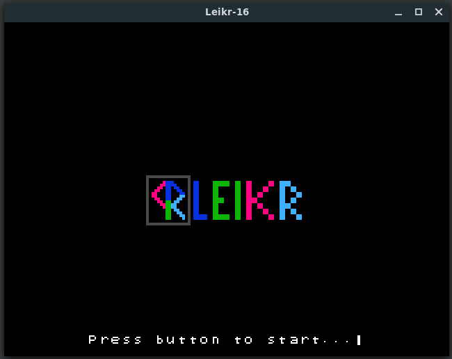
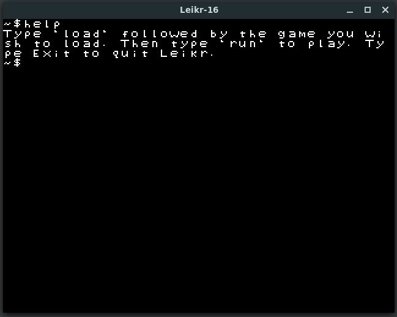
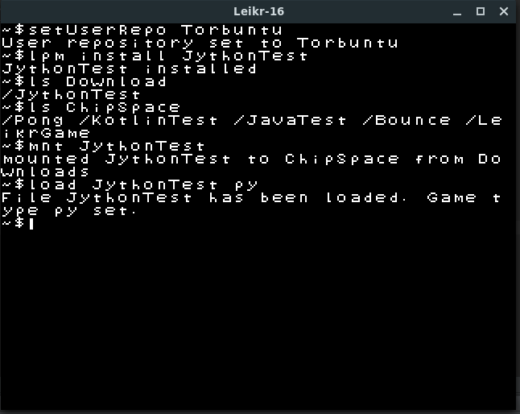
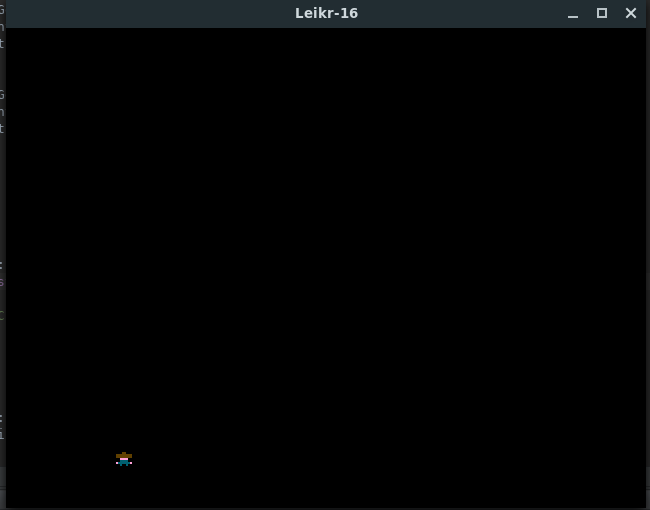
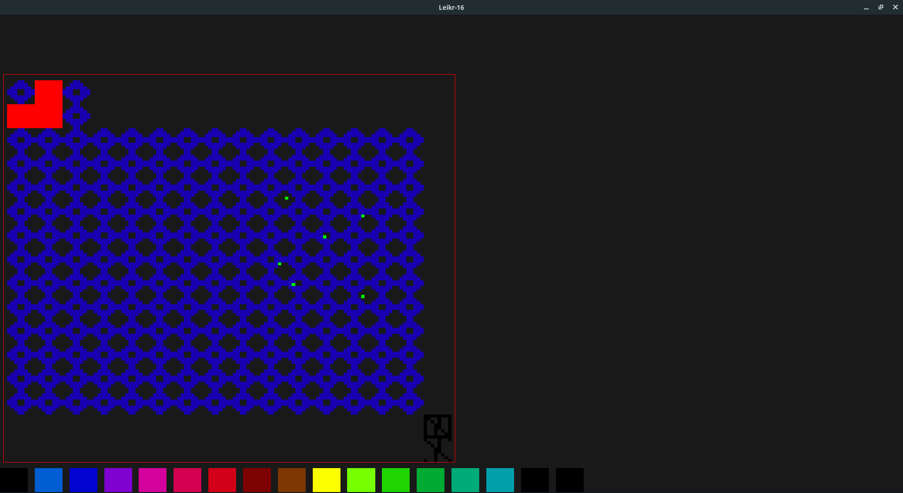
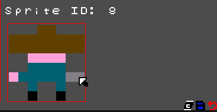
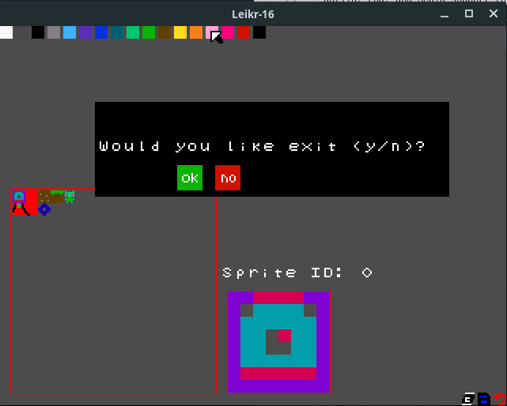
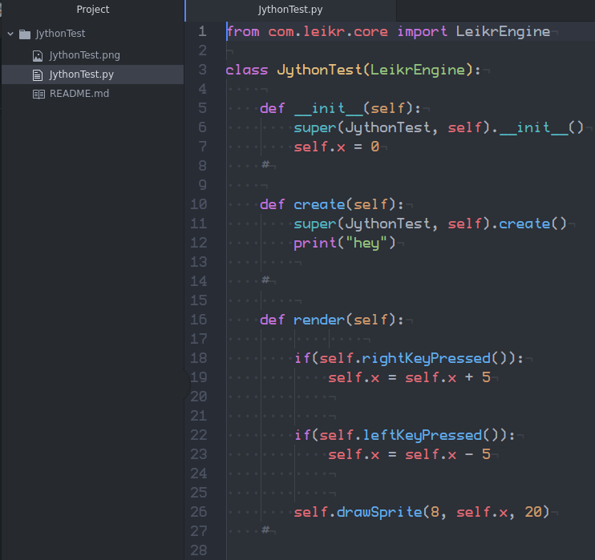

# Leikr16

A Java Fantasy Computer.
- Written in Java libgdx and Groovy.
- Supports games written in Java, Groovy, and Jython (using the Leikr Engine)

# Specs
- Resolution 320x240
- 256 8x8 Sprites
- 640x120 Tiled Map (each tile is 8x8). (4 screens tall and 16 wide)

INFO: if you do a gradle dist for the desktop jar the LeikrVirtualDrive will not be able to copy to the user directory so it will need to be extracted manually. 

# Current features
- Terminal Emulator. Not many commands yet.
- Groovysh repl by prefixing commands with `gv`.
- Small games can be loaded and played by typing `load [game name] [optional: game type]` then `run` games loaded from the ChipSpace directory.
- Exit to Terminal with ESC
- Sprite Editor. (functional, but needs improvement)
- Github repo downloads using `setUserRepo [github username]` then `lpm install [repo name]`. Then to load the game use `mnt [game name]` which will load the game from the Download directory into ChipSpace. Then you can `load [game name]` and `run`. (Will add support for other git repos with the `setRepoType [repo type]` command in teh future.
- settings.properties file for customizing the colors of the background and font in terminal as well as the font itself (font name file and size in width and height).

# Potential/Planned Features
- Customizable Graphical interface instead of terminal (after setting up a System Config that points to a graphical environment on boot. API for this to be created )
- More advanced terminal/console commands (update games, upload games to repo, etc...)
- Code Editor
- Map Editor
- Music and editor
- SFX and editor
- Kotlin, Lua, and Scala support for game coding 

